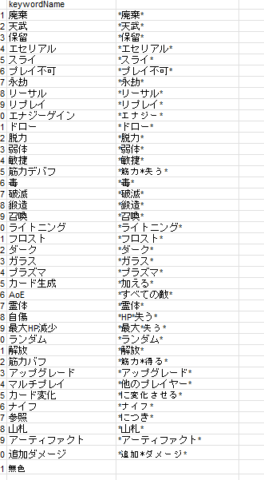

# はじめに
このシステムはSlay the Spire2のカード情報を提供するための**非公式webAPIです**。このAPIから提供される**全てのテキストの著作権はMega Crit Gamesに帰属します**。
# システム概要
*Slay the Spire CardDB API*

ゲーム「**Slay the Spire2**」のカード情報を提供する非公式webAPI

# 提供する機能
出力はJSON形式で送られる
- カード名検索（前方一致）機能
- キャラクター名/コスト/カード種別/キーワード1・キーワード2を自由に指定した検索機能
- 規定済のキーワードを出力する機能

# 技術スタック
- 言語:Java17
- フレームワーク:SpringBoot
- ビルドツール:Maven
- DB:MySQL
- IDE:IntelliJ IDEA
- バージョン管理:git/github
# APIエンドポイント
## プレフィックス
/api/v1/StS2ciAPI
## GET /getAllCardsInfo
全てのカード情報を出力する
### パラメータ
なし
## GET /name
カード名を前方一致で検索する
1枚のカードにつき強化前と強化後の2つのデータを返す
### パラメータ
?name=[カード名]
### レスポンス例(検索ワード:"悪魔化")
```HTTP
GET http://localhost:8080/api/v1/StS2ciAPI/name?name=悪魔化
```
``` JSON
[
    {
        "cardID":173,
        "cardName":"悪魔化",
        "cardType":"パワー",
        "rarity":"レア",
        "cost":"3",
        "effect":"ターン開始時、筋力2を得る。",
    },
    {
        "cardID":174,
        "cardName":"悪魔化＋",
        "cardType":"パワー",
        "rarity":"レア",
        "cost":"3",
        "effect":"ターン開始時、筋力3を得る。",
    }
    
]
```
## GET /search
カード名以外の情報からカードを検索する
検索に使用するパラメータは全て省略可能
また、キーワードは検索性を上げるために規定している（後述）
### パラメータ
- コスト(文字列） 
- レアリティ（文字列）
- カードタイプ（文字列）
- キャラクター名（文字列）
- キーワード1（文字列）
- キーワード2（文字列）
### レスポンス例(検索キーワード:キャラ名/リージェント,レアリティ/コモン,コスト/1,キーワード1/,エナジーゲイン,キーワード2/鍛造)
```HTTP
GET http://localhost:8080/api/v1/StS2ciAPI/search?charname=リージェント&rarity=コモン&cost=1&keyword1=エナジーゲイン&keyword2=鍛造
```
``` JSON
[
    {
        "cardID":425,
        "cardName":"剣の研磨",
        "cardType":"スキル",
        "rarity":"コモン",
        "cost":"1",
        "effect":"鍛造6。次のターン、エナジーを得る。",
        "upgradedCardId":426
    },
    {
        "cardID":426,
        "cardName":"剣の研磨＋",
        "cardType":"スキル",
        "rarity":"コモン",
        "cost":"1",
        "effect":"鍛造10。次のターン、エナジーを得る。",
        "upgradedCardId":null
    }

]
```
## GET /keywords
規定された検索用キーワード一覧を取得する
### パラメータ
なし
## レスポンス
```json
[
  {
    "keywordID": 1,
    "keywordName": "廃棄"
  },
  {
    "keywordID": 2,
    "keywordName": "天武"
  },
  {
    "keywordID": 3,
    "keywordName": "保留"
  },
  {
    "keywordID": 4,
    "keywordName": "エセリアル"
  },
  {
    "keywordID": 5,
    "keywordName": "スライ"
  },
  {
    "keywordID": 6,
    "keywordName": "プレイ不可"
  },
  {
    "keywordID": 7,
    "keywordName": "永劫"
  },
  {
    "keywordID": 8,
    "keywordName": "リーサル"
  },
  {
    "keywordID": 9,
    "keywordName": "リプレイ"
  },
  {
    "keywordID": 10,
    "keywordName": "エナジーゲイン"
  },
  {
    "keywordID": 11,
    "keywordName": "ドロー"
  },
  {
    "keywordID": 12,
    "keywordName": "脱力"
  },
  {
    "keywordID": 13,
    "keywordName": "弱体"
  },
  {
    "keywordID": 14,
    "keywordName": "敏捷"
  },
  {
    "keywordID": 15,
    "keywordName": "筋力デバフ"
  },
  {
    "keywordID": 16,
    "keywordName": "毒"
  },
  {
    "keywordID": 17,
    "keywordName": "破滅"
  },
  {
    "keywordID": 18,
    "keywordName": "鍛造"
  },
  {
    "keywordID": 19,
    "keywordName": "召喚"
  },
  {
    "keywordID": 20,
    "keywordName": "ライトニング"
  },
  {
    "keywordID": 21,
    "keywordName": "フロスト"
  },
  {
    "keywordID": 22,
    "keywordName": "ダーク"
  },
  {
    "keywordID": 23,
    "keywordName": "ガラス"
  },
  {
    "keywordID": 24,
    "keywordName": "プラズマ"
  },
  {
    "keywordID": 25,
    "keywordName": "カード生成"
  },
  {
    "keywordID": 26,
    "keywordName": "AoE"
  },
  {
    "keywordID": 27,
    "keywordName": "霊体"
  },
  {
    "keywordID": 28,
    "keywordName": "自傷"
  },
  {
    "keywordID": 29,
    "keywordName": "最大HP減少"
  },
  {
    "keywordID": 30,
    "keywordName": "ランダム"
  },
  {
    "keywordID": 31,
    "keywordName": "解放"
  },
  {
    "keywordID": 32,
    "keywordName": "筋力バフ"
  },
  {
    "keywordID": 33,
    "keywordName": "アップグレード"
  },
  {
    "keywordID": 34,
    "keywordName": "マルチプレイ"
  },
  {
    "keywordID": 35,
    "keywordName": "カード変化"
  },
  {
    "keywordID": 36,
    "keywordName": "ナイフ"
  },
  {
    "keywordID": 37,
    "keywordName": "参照"
  },
  {
    "keywordID": 38,
    "keywordName": "山札"
  },
  {
    "keywordID": 39,
    "keywordName": "アーティファクト"
  },
  {
    "keywordID": 40,
    "keywordName": "追加ダメージ"
  },
  {
    "keywordID": 41,
    "keywordName": "無色"
  }
]
```
# DB構造


# 設計の工夫点
## キーワードについて
Slay the Spire2のカードには”天賦”や”保留といった、”キーワード"という概念が存在している。<br>
しかし、カードの特性としての効果（例:山札のカードを参照して攻撃力が上がる/自らにダメージを与えて効果を発動する　など）に関しては特定のキーワードが定められているわけではなく、直感的な検索が行えないと考えた。<br>
そこで、それらの特性を新たにキーワードとして、端的に表す言葉で定義することで、検索を行いやすくした。<br>

また、一つのカードは複数のキーワードを持つ場合があるため、中間テーブルを使用し、多対多の関係を扱えるようにした。<br>
中間テーブルのデータを作成する際、カードのテキスト(effectテーブル)の文章に着目し、パターンマッチングを使用することで、ほとんどの効果についてマクロでデータを作成できるようにした。<br>
<br>
しかし、一部特殊なテキストを持つカード（例:手札をデブリで満たす/デッキから手札にカードを加える)に関しては正しくデータが作成されなかったり、属性である無色カードに関しては手動でデータを作成する必要があった為、上手く改善できないか考えている。<br>

## 検索について
逆引き検索を実装する際、必要なパラメーター全てを入力させるのではなく、一部のみ入力しても正常な結果を返すように設計しようと考えた。<br>
しかし、JPAのメソッド名によるクエリ作成ではこの様な検索を実装することが難しいと考えたため、SQLを記述してメソッドを実装することにした。
```java
    //逆引き検索

    @Query("SELECT DISTINCT  c FROM CardsEntity c " +
            "LEFT JOIN c.character ch " +
            "WHERE " +
            "(:cost IS NULL OR c.cost = :cost) AND " +
            "(:rarity IS NULL OR c.rarity = :rarity) AND " +
            "(:type IS NULL OR c.cardType = :type) AND " +
            "(:charName IS NULL OR ch.characterName = :charName) AND " +
            "(:keywordName1 IS NULL OR EXISTS (SELECT k1 FROM CardsEntity c1 JOIN c1.keyword k1 WHERE c1 = c AND k1.keywordName = :keywordName1)) AND " +
            "(:keywordName2 IS NULL OR EXISTS (SELECT k2 FROM CardsEntity c2 JOIN c2.keyword k2 WHERE c2 = c AND k2.keywordName = :keywordName2))"
    )
    List<CardsEntity> searchCardsOfConditions(
            @Param("cost") String cost,
            @Param("rarity") String rarity,
            @Param("type") String type,
            @Param("charName") String charName,
            @Param("keywordName1") String keywordName1,
            @Param("keywordName2") String keywordName2
    );
```
ここで、パラメータの入力が任意であっても正常に動作する方法がないか調べた所、IS NULLを組み合わせる事で実現できることを知り、実装を行った。<br>
これは、パラメータが与えられたときはORの右辺に代入され、合致するレコードの場合はTrueとなり絞り込みが行われる。そして、パラメータが与えられていないときは左辺がNULL IS NULL = Trueになり、全数検索が行われる（その項目では絞り込まない）という挙動となる。<br>
そして、キーワード検索部分のOR EXISTSについては、キーワードが代入されなかった場合の挙動は他と同じで、与えられた場合はサブクエリでキーワード名がそのカードに含まれているか中間テーブルを通して検証し、含まれているなら絞り込みが行われ、存在しなければFalseとなる。<br>

# TODO

現段階ではフロントエンド（DiscordBot)と同時並行的に開発を行っており、それと組み合わせることで最低限機能する段階であるため、単体でも動作する様今後追加するべき機能を列挙する。

- キーワード検索における、バックエンド側でのバリデーション処理
- エラーハンドリング処理の追加
